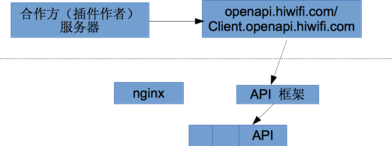
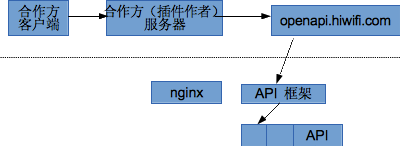
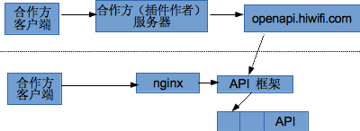

# OpenAPI


## 简介

openapi  接口有两个域名 openapi.hiwifi.com  和 client.openapi.hiwifi.com

当路由器安装了某个插件后，插件的作者就可以通过 openapi.hiwifi.com 来调用这个路由器里面的一些接口。能调用哪些接口是由插件安装时配置的。参见 [#appperm 插件权限]。 为了调用此 api, 调用者需要使用制作插件时候的 app_key 和  app_secret 来对请求签名。openapi.hiwifi.com 的 api 提供对单独路由器的调用，也提供对多个路由器的群发功能。调用路径如下图所示



有时插件作者可能会有客户端软件，客户端通过 openapi.hiwifi.com 和安装插件的路由器绑定以后，就可以通过 client.openapi.hiwifi.com 直接调用绑定路由器里面的接口，接口权限和 openapi.hiwifi.com 的是相同的。绑定以后 openapi.hiwifi.com 会返回一个 client_secret, 调用 client.openapi.hiwifi.com 需要用此 client_secret 对请求签名。在路由器的局域网内，client.openapi.hiwifi.com 这个域名会被拦截到路由器本身，因此客户端只要访问 client.openapi.hiwifi.com 就可以直接访问到路由器而不经过外网。 client.openapi.hiwifi.com 仅提供对单个路由器的调用。无法提供群发功能。

绑定调用路径如下



客户端远程和本地调用路径如下




路由器对外提供的方法由 lua 编写，可以由插件进行扩展。方法以命名空间来组织，命名空间之间以 . 分割，例如 {{{ network.wireless.set_ssid }}} 和 {{{ apps.sohutv.download_movie }}} 都是合法的方法名。 命名空间的分配见 [#namespace 方法命名空间]

## openapi.hiwifi.com 接口

openapi.hiwifi.com 提供一组 API 用于对路由器的绑定授权，查询路由器的工作状态，以及直接调用路由接口。

* 注意，调用者只能对安装了自己插件的路由器进行调用和查询状态，对没有安装自己插件的路由器是没有权限的。

接口格式如下 

```
http(s)://openapi.hiwifi.com/{action}?sign={sign}
```

使用 POST 方式提交 JSON 格式的请求，Content-Type 需要设置为 application/json

sign 值生成规则如下(以 php 代码作为例子)

```php
$action = 'call';
$jsonbody = '{"app_id" : "12345", "app_name" : "abcd", "dev_id": "D4EE07012345" , "method": "network.wireless.set_ssid", data: { "ssid" : "HiWiFi_XXX" }}';
$app_secret = 'AAAAAAAAAAA';
$str = $action.$jsonbody.$app_secret;
$sign = md5($str);
```

输出格式统一为 json ，格式如下
```javascript
{
    "app_code" : "路由器返回代码",
    "app_msg" : "路由器返回文字描述,
    "app_data" : { "路由器返回的其他数据" },
    "code" : "平台返回代码",
    "msg" : "平台返回文字描述,
    "data" : { "平台返回其他数据" }
}
```

code 表明操作是否执行成功，0 表示成功，其他错误请参见 [#errortable 错误列表]

* action 包含：
[#bind bind  绑定]\\
[#unbind unbind  解除绑定]\\
[#call call 调用api]\\
[#status status 获取状态]\\
[#call_multi call_multi 多设备调用]\\
[#call_multi_result call_multi_result 查询 call_multi 请求的结果]\\

### bind

bind 接口用于对设备授权，插件作者可以通过调用此 API 来授权其某个客户端对安装了本插件的某台特定路由器进行调用。参数验证通过后，服务器会生成一个 client_secret, 首先调用路由器端的授权接口下发此 client_secret, 成功则返回此 client_secret

输入参数:
|参数名 | 类型| 说明 |
| ---- | ---- | ----- | 
| app_id | string |插件的 APP_KEY, 可以从 open.hiwifi.com 插件基本信息页面看到|
|app_name| string | 插件名字, 申请插件的时候取的，不要包含空格及其他特殊符号 |
|client_id | string | 插件作者需要绑定客户端安装实例的 ID, 客户端app_id + client_id 可以唯一确定一个 app  安装实例 |
|dev_id | string | 需要绑定的路由器id, 即MAC 地址，全大写 |
|permissions |object | 可选参数，需要授权的 API 命名空间列表. 默认只可以调用所有 apps.{app_id}.下面所有方法 |
|expire_period | int |可选参数，授权过期时间(暂未实现) |

输出 data 对象：
| 字段名 |  类型 | 说明 |
| ---- | ---- | ----- | 
| client_secret | string  | 授权完成的secret，可以用于对 client.openapi.hiwifi.com 调用的签名 |


* 注意，路由器重置后，授权将自动丢失，可以重新调用此接口来进行授权。

### unbind

unbind 接口用于对取消对设备授权，解绑后客户端将不再能调用此路由器

输入参数:
| 参数名 | 类型 | 说明 |
| ---- | ---- | ----- | 
| app_id | string |插件的 APP_KEY, 可以从 open.hiwifi.com 插件基本信息页面看到|
| app_name | string |插件名字, 申请插件的时候取的，不要包含空格及其他特殊符号|
| client_id |string | 插件作者需要绑定客户端安装实例的 ID, 客户端app_id + client_id 可以唯一确定一个 app  安装实例|
| dev_id  | string | 需要绑定的路由器id, 即MAC 地址，全大写 |

输出 data 对象

### status

status 接口用于查询路由器一些基本信息，目前只支持在线状态。

输入参数:
| 参数名 | 类型 | 说明 |
| ----- | --- | ---- |
| app_id | string | 插件的 APP_KEY, 可以从 open.hiwifi.com 插件基本信息页面看到 |
| app_name | string | 插件名字, 申请插件的时候取的，不要包含空格及其他特殊符号 |
| dev_id | string | 需要绑定的路由器id, 即MAC 地址，全大写 |

输出 data 对象：
| 字段名 | 类型 | 说明 |
| ----- | --- | ---- |
| is_online | int | 1为在线，0为离线 |

### call

call 接口用于直接对路由器中的接口进行同步调用，此接口只支持单台路由器调用。如果路由器不在线，将返回错误。

输入参数:
|参数名 | 类型 | 说明 |
| ----- | --- | ---- |
| app_id | string | 插件的 APP_KEY, 可以从 open.hiwifi.com 插件基本信息页面看到|
| app_name | string | 插件名字, 申请插件的时候取的，不要包含空格及其他特殊符号 |
| dev_id | string | 需要调用路由器id, 即MAC 地址，全大写 |
| timeout | string | 超时时间，以秒为单位，超过此时间将返回一个超时错误 |
| method | string | 需要调用的方法名|
|data | object | 方法需要的参数 |

输出 data 对象：
| 字段名 | 类型 | 说明 |
| ----- | --- | ---- |
| code | int | 返回代码，0为成功 |
| data | string | 路由器接口输出内容|


### call_multi

call_multi 接口用于对多台路由器的接口进行调用，此接口支持对多台路由器进行调用，但是必须是异步方式，从此接口无法立即得到执行结果，即使有路由器不在线也不会立即返回错误。

输入参数:
| 参数名 | 类型 | 说明 |
| ----- | ---- | ---- |
| app_id | string | 插件的 APP_KEY, 可以从 open.hiwifi.com 插件基本信息页面看到|
| app_name | string | 插件名字, 申请插件的时候取的，不要包含空格及其他特殊符号 |
| dev_ids | object或string | 如果是列表，则调用列表中的所有路由器，如果是字符串，则调用这一台路由器，如果字符串为 "all"，则表示要对所有安装了此插件的路由器进行调用 |
| skip_offline | int | 可选参数，是否跳过不在线的路由器，为 1时，则所有在命令发出时不在线的路由器将被立即跳过，否则命令将会被暂存至路由器上线再进行推送，超过 timeout 时间后如果还没有上线，此命令将被丢弃 |
| timeout | int | 可选参数，超时时间，以秒为单位，默认为1天即 86400 秒，在超时时间前，服务器将会保存此次调用的执行结果供查询，对于未上线的路由器，也会存储命令待其上线再进行推送，超时时间到以后此次执行结果将会被删除|
| method | string | 需要调用的方法名 |
| data | object | 方法需要的参数 |

输出 data 对象：
| 字段名 | 类型 | 说明 |
| ----- | --- | ---- |
| code | int | 返回代码，0为成功 |
| request_id | string | 本次查询的请求 id |

### call_multi_result

call_multi_result 接口用于查询 call_multi 请求的结果，请求结果将会被保留到超时时间以后删除。

输入参数:
| 参数名 | 类型 | 说明 |
| ----- | --- | ---- |
| app_id | string | 插件的 APP_KEY, 可以从 open.hiwifi.com 插件基本信息页面看到 |
| app_name | string | 插件名字, 申请插件的时候取的，不要包含空格及其他特殊符号 |
| request_id | string | call_multi调用时返回的请求 id |

输出 data 对象：
| 字段名 | 类型 | 说明 |
| ----- | --- | ---- |
| code | int | 返回代码，0为成功 |
| results | object | 执行结果，此 object 是一个数组，每个元素是一个 object, 包含三个成员，"dev_id" , "code",  "data"。数组里面存放的是所有有回应的路由器的输出结果，没有回应或者没有下发的都不在这里出现。 |


## client.openapi.hiwifi.com 接口

client.openapi.hiwifi.com 提供 API 用于对已经绑定的路由器进行接口调用。

接口格式如下 

```
http://client.openapi.hiwifi.com/{action}?sign={sign}&dev_id={dev_id}
```

* 注意此接口不支持 https。

使用 POST 方式提交 JSON 格式的请求，Content-Type 需要设置为 application/json

dev_id 为准备调用的设备的MAC地址

sign 值生成规则如下(以 php 代码作为例子)

```php
$action = 'call';
$jsonbody = '{"app_id" : "12345", "app_name" : "abcd", "client_id" : "abcdefgh", "dev_id": "D4EE07010000" , data: { "a" : "aa" }}';
$client_secret = 'AAAAAAAAAAA';  // 这个是在 bind 接口调用返回的 client_secret
$str = $action.$jsonbody.$client_secret;
$sign = md5($str);
```

输出格式统一为 json ，格式如下
```javascript
{
    "app_code" : "路由器返回代码",
    "app_msg" : "路由器返回文字描述,
    "app_data" : { "路由器返回的其他数据" },
    "code" : "平台返回代码",
    "msg" : "平台返回文字描述,
    "data" : { "平台返回其他数据" }
}
```


### call

call 接口用于直接对路由器中的接口进行同步调用，此接口只支持单台路由器调用。如果路由器不在线，将返回错误。

输入参数:
| 参数名 | 类型 | 说明 |
| ----- | ---- | ---- |
| app_id | string | 插件的 APP_KEY, 可以从 open.hiwifi.com 插件基本信息页面看到 |
| app_name | string | 插件名字, 申请插件的时候取的，不要包含空格及其他特殊符号 |
| client_id | string |客户端 id |
| dev_id | string |需要调用路由器id, 即MAC 地址，全大写 |
| timeout | string |超时时间，以秒为单位，超过此时间将返回一个超时错误 |
| method | string |需要调用的方法名 |
| data | object |方法需要的参数 |

输出 data 对象：
| 字段名 | 类型 | 说明 |
| ----- | --- | ---- |
| code | int | 返回代码，0为成功 |
| data |string | 路由器接口输出内容 |

* 在局域网环境下，此域名会被劫持至路由器端，从而实现直接对路由器接口的调用，但是为了防止出现客户端走到其他的极路由下面造成无法访问接口的现象，路由器会检查 dev_id 是否和自己一致，如果不一致将会将这个请求直接 proxy 到外网的对应服务器上。如果一致将会由本地路由器处理。


### status

status 接口用于查询路由器一些基本信息，目前只支持在线状态。

输入参数:
| 参数名 | 类型 | 说明 |
| ---- | ---- | ---- |
| app_id | string |插件的 APP_KEY, 可以从 open.hiwifi.com 插件基本信息页面看到 |
| app_name |string |插件名字, 申请插件的时候取的，不要包含空格及其他特殊符号 |
| client_id |string |客户端 id |
| dev_id |string | 需要绑定的路由器id, 即MAC 地址，全大写 |

输出 data 对象：
||字段名||类型||说明||
||is_online||int||1为在线，0为离线||

* 此接口和 openapi.hiwifi.com 的看起来非常相似，不同点在于，当路由器无法上外网时候，用 openapi.hiwifi.com 查询将会失败或者报不在线，也无法调用此路由器，而用此接口对本路由器的 dev_id 查询可以返回 online。换句话说。此接口只要返回 online, 就可以正常对 dev_id 路由器进行调用，而不用管它到底有没有连接外网。

### router_info
router_info接口返回路由器的系统版本，mac地址等信息
输入参数:
返回结果
```javascript
{
    "app_msg": "",
    "source": "1",
    "code": "0",
    "app_code": "0",
    "msg": "",
    "data": "",
    "app_data": {
        "mac": "D4EE07XXXXXX",
        "version": "0.9004.3505s",
        "board": "HC5661"
    }
}
```


## 方法命名空间 namespace

路由器导出的方法列表以命名空间来划分，例如 system 表示系统级别的 API,  component 表示系统自带组件的 API，此外还有一些特殊的命名空间，常见命名空间如下表所示

| 命名空间 | 含义 |
| ---- | ----- |
| system | 系统相关 API, 例如 system.admin.reboot 方法可以重启路由器 |
| component | 系统组件相关 API，如 component.aria2.download |
| apps | 插件自有API, 一般格式为 apps.<appid>.方法名，用于存放插件特有的 API，默认的 bind 授权仅授予此命名空间下此插件空间的 API |
| legacy | 历史接口适配，新接口应该尽量避免使用，例如 legacy.luci 接口下面可以桥接到原来的 luci API |
| unsigned | 位于此命名空间下的函数都不需要验证sign字串，这类调用是为某些特殊需求的客户准备的，一般情况不要使用 |

## 插件权限管理 appperm

从路由器的角度来看，插件权限有几种情况。

1. 插件作者的远程服务器可以调用这个插件被允许调用的所有 API，

2. 当插件作者有客户端安装时候，此时可以通过 bind 接口授权来为单独的客户端和单独的路由器建立信任关系。授权默认只提供 apps.<app_id>. 下面所有的权限。可以单独在 bind 接口中列出所需权限，权限最大不得超过这个插件本身被允许调用的所有 API。

3. 对于 unsigned 命名空间下的接口，因为它不需要验证签名，所以不进行权限控制，服务器端对见到的此类报文一概拒绝，路由器端见到此接口只判断此 API 是否存在。


### 错误代码表

| code | 描述 |
| ----- | ------ |
| 0 | 执行成功 |
| 100001 | 系统内部错误 |
| 100002 | 方法解析失败 |
| 100003 | 权限认证失败 |
| 100004 | api没找到 |
| 100005 | 插件未安装或者未授权 |	
| 100006 | 客户端密匙不合法 |
| 100007 | 客户端已被绑定 |
| 100008 | 客户端申请权限超出允许范围 |
| 100009 | 调用方法数据格式错误 |
| 100010 | 权限列表丢失 |
| 100011 | 校验参数不合法 |
| 100012 | 客户端未绑定 |
| 100013 | 客户端密匙丢失 |
| 100014 | 校验失败 |
| 100015 | 无权限 |
| 100016 | app_id或者client_id不合法 |
| 100017 | 数据格式应该为application/json |
| 100018 | 调用client端接口的时候发现未知的方法 |
| 100019 | 请输入客户端ID:client_id |


### openapi v1 接口文档
[接口文档压缩包](openapi_v1_doc.tgz)